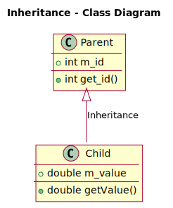

# Конструювання базових та похідних класів
**Мета**: Створити, відлагодити та протестувати програму, у якій створити базовий та похідні класи для обробки даних.

## Вказівки до роботи
Відповідно до цієї інструкції вам потрібно у середовищі Visual Studio Code з використанням набору компіляторів GCC створити   програму мовою C++ з базовим (батьківським) та похідними (дочірніми) класами для обробки даних та реалізувати конструктори, деструктори, методи. Використайте динамічний масив (вектор) структур для зберігання введених даних. Також методи зміни полів класу 
повинні перевіряти валідність заданих змінних. Потрібно реалізувати багатофайловий проєкт у середовищі Visual Studio Code з описом кожного класу у відповідних парах заголовного та виконуваного файлів.
1. Ознайомитися із властивостями базового (батьківського) та похідного (дочірнього) класів. Обдумати способи їх використання для   створення програм.
2. Вибрати завдання згідно свого варіанту у ДОДАТКУ.
3. Розробити блок-схему алгоритму програми.
4. Реалізувати програму для вводу і виводу даних полів (членів) структур вкладених у клас.

### Короткі відомості
Спадкування в C++ відбувається між класами і має тип відносин «є». Клас, від якого успадковують, називається батьківським (або “базовим”, “суперкласом”), а клас, який успадковує, називається дочірнім (або “похідним”, “підкласом”). У цьому прикладі клас Child є дочірнім, а клас Parent — батьківським. 



Використання спадкування означає, що нам не потрібно перевизначати інформацію з батьківських класів в дочірніх. Ми автоматично отримуємо методи і змінні-члени суперкласу через спадкування, а потім просто додаємо специфічні методи або змінні-члени, які 
хочемо. Це не тільки економить час і зусилля, але також є дуже ефективним: якщо ми коли-небудь оновимо або змінимо базовий клас (наприклад, додамо нові функції або виправимо помилку), то всі наші похідні класи автоматично успадкують ці зміни. 
Дочірній клас успадковує як поведінку (методи), так і властивості (змінні-члени) від батьківського (з урахуванням деяких обмежень доступу). Ці методи і змінні стають членами дочірнього класу. Оскільки дочірні класи є повноцінними класами, то вони можуть (звичайно) мати і свої власні члени. 
Коли C++ створює об’єкти дочірніх класів, то він робить це поетапно – завжди йде побудова з «першого» або «топового» класу ієрархії.  Потім C++ переходить до наступного класу ієрархії і виконує його побудову. Цей процес послідовний. Спочатку створюється найвищий клас ієрархії (батьківський). Потім створюється дочірній клас, який йде наступним по порядку, і так до тих пір, поки не буде створено останній клас (той, який знаходиться в самому низу ієрархії). 
Компілятор спочатку C++ виділяє пам’ять для класу Parent, потім викликається конструктор за замовчуванням класу `Parent` для виконання ініціалізації. Оскільки клас `Child` успадковує змінні-члени і методи класу `Parent`, то ви можете припустити, що члени класу `Parent` копіюються в клас `Child`, але це не так. Замість цього розглядайте `Child` як клас, який складається з двох частин: перша — `Parent`, друга — `Child`. При створенні `Child` спочатку створюється частина `Parent` класу `Child`. У цьому є сенс, тому що (логічно) дитина не може існувати без батьків. Це також сприяє безпеці та ефективності виконання коду: дочірній клас часто використовує змінні-члени і методи батька, але батьківський клас нічого не знає про свій дочірній клас. Початкова ініціалізація батьківського класу гарантує, що його   змінні-члени і методи будуть проініціалізовані до моменту використання їх дочірнім класом.
```c++
#include <iostream>
class Parent
{
public:
    int m_id;
 
    Parent(int id=0)
        : m_id(id)
    {
    }
 
    int getId() const { return m_id; }
};
class Child: public Parent
{
public:
    double m_value;
 
    Child(double value=0.0, int id=0)
        : Parent(id), // викликається конструктор Parent(int) зі значенням id!
         m_value(value)
    {
    }
 
    double getValue() const { return m_value; }
};
int main()
{
    Child   child(1.5,   7);   //   викликається   конструктор Child(double, int)
    std::cout << "ID: " << child.getId() << '\n';
    std::cout << "Value: " << child.getValue() << '\n';
 
    return 0;
}
```
Тепер, коли ми знаємо про ініціалізацію членів батьківського класу, немає ніякої необхідності зберігати наші змінні-члени відкритими. Ми зробимо їх private, як і повинно бути.
Доступ до членів public відкритий для всіх. Доступ до членів private відкритий тільки для інших членів цього ж класу. Зверніть увагу, це означає, що дочірні класи не можуть напряму звертатися до закритих членів батьківського класу. Дочірнім класам потрібно використовувати геттери і сеттери для доступу до цих членів, наприклад:
```c++
#include <iostream>
 
class Parent
{
private: // наш m_id тепер закритий
    int m_id;
 
public:
    Parent(int id=0)
        : m_id(id)
    {
    }
 
    int getId() const { return m_id; }
};
class Child: public Parent
{
private: // наш m_value тепер закритий
    double m_value;
 
public:
    Child(double value=0.0, int id=0)
        : Parent(id), // викликається конструктор Parent(int) зі значенням id!
            m_value(value)
    {
    }
 
    double getValue() const { return m_value; }
};
 
int main()
{
    Child   child(1.5,   7);   //   викликається   конструктор Child(double, int)
    std::cout << "ID: " << child.getId() << '\n';
    std::cout << "Value: " << child.getValue() << '\n';
 
    return 0;
}
```

## Хід роботи:
Рекомендації до роботи:
1. продумайте, які типи змінних вам потрібно використати для виконання завдання.
2. створіть проєкт із кількома файлами, тобто крім основного файлу, наприклад main.cpp, додайте для кожного класу заголовний файл <class>.h та виконуваний файл <class>.cpp. Також модифікуйте `..\.vscode\tasks.json`, щоб вказати йому шлях до всіх файлів проекту.
3. у заголовних файлах оголосіть базовий (батьківський) та похідний (дочірній) класи, а також відповідні структури для збереження і обробки даних. Для початку можете спробувати розробити програму із public-членами оголошених класів, а потім модифікуйте її так, щоб члени батьківського та дочірнього класів були private.
4. у виконуваних файлах реалізуйте конструктори та деструктори, методи для введення і виведення даних.
5. методи введення чи зміни полів класу повинні перевіряти валідність заданих змінних і попереджувати користувача про некоректні значення.
6. можете збільшити кількість членів класу додатковими полями чи методами.
7. обчислити результат відповідно заданого варіанту, наприклад загальну вартість, тривалість, кількість, максимальне чи мінімальне значення тощо.
8. програма має вивести на консоль (термінал) вхідні дані та результат виконання.

### Оформлення звіту
У звіті студент має вказати свій варіант індивідуального завдання та представити:
1. Блок-схему алгоритму програми.
2. Код (лістинг) програми.
3. Результати тестування для різних вхідних умов.
4. Конструктивний висновок — що ви дізналися нового, чого навчилися, якими способами та інструментами досягнули мети.

## ДОДАТОК

### Варіанти завдань

|  № |       Батьківський клас       |                   Дочірні класи                  |
|----|-------------------------------|--------------------------------------------------|
|  1 | Джерело живлення              | Павербанк, бензиновий/дизель генератор           |
|  2 | Сенсор                        | Датчик температури, датчик світла                |
|  3 | Прилад                        | Мультиметр, осцилограф                           |
|  4 | Провідник сигналів            | Коаксіальний кабель, оптоволокно                 |
|  5 | Радіостанція                  | Базова станція, портативна рація                 |
|  6 | Мікросхема                    | Логічна мікросхема, пам’ять                      |
|  7 | Фільтр                        | Фільтр нижніх частот, смуговий фільтр            |
|  8 | Транзистор                    | Біполярний транзистор, польовий транзистор       |
|  9 | Напівпровідниковий діод       | Стабілітрон, тунельний діод                      |
| 10 | Комунікаційний пристрій       | Маршрутизатор, комутатор                         |
| 11 | Канал передавання даних       | Радіоканал, оптоволоконний канал                 |
| 12 | Двигун                        | Серводвигун, кроковий двигун                     |
| 13 | Зчитувач інформації           | Сканер штрих-коду, RFID-зчитувач                 |
| 14 | Електронна плата              | Макетна плата, друкована плата                   |
| 15 | Контролер                     | Мікроконтролер, програмований логічний контролер |
| 16 | Акумулятор                    | Літій-іонний, свинцево-кислотний                 |
| 17 | Антена                        | Всеспрямована антена, антена направленої дії     |
| 18 | Електромагнітний випромінювач | Світлодіод, лазер                                |
| 19 | Оптичний компонент            | Світлодіод, фоторезистор                         |
| 20 | Звуковий пристрій             | Мікрофон, динамік                                |
| 21 | Дисплей                       | Рідкокристалічний дисплей, OLED-дисплей          |
| 22 | Бездротова технологія         | WiFi, Bluetooth                                  |
| 23 | Операційна система            | Android, iOS                                     |
| 24 | Резонатор                     | Кварцовий резонатор, керамічний резонатор        |
| 25 | Супутниковий термінал         | Термінал для зв’язку, термінал для телебачення   |
| 26 | Датчик руху                   | Інфрачервоний датчик, радарний датчик            |
| 27 | Перетворювач напруги          | Підсилювач напруги, послаблювач напруги          |
| 28 | Реле                          | Електромагнітне реле, твердотільне реле          |
| 29 | Мобільний телефон             | Кнопковий телефон, смартфон                      |
| 30 | Електронний компонент         | Пасивний компонент, активний компонент           |
